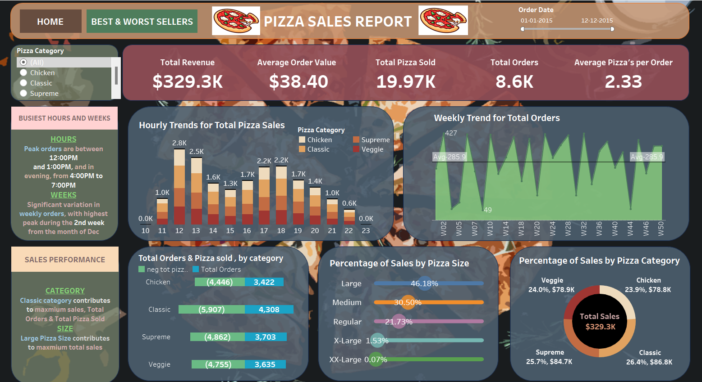
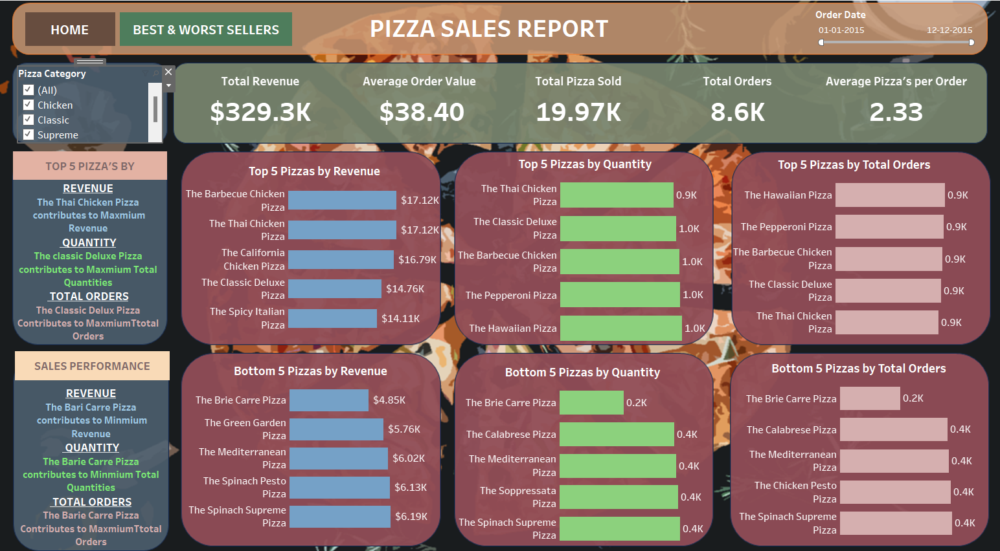

# Pizza_sales_dashboard

# Pizza Sales Data Analysis and Visualization

## Overview

This repository features an SQL KPI Query that serves as the foundation for a comprehensive dashboard designed to analyze and visualize pizza sales data. The dashboard incorporates insightful trends and patterns, complemented by interactive charts and graphs. The goal is to facilitate a deeper understanding and effective communication of the derived data insights.

## Key Performance Indicators (KPIs)

- Total Revenue
- Total Pizza Sold
- Average Order Value
- Total Order
- Average Pizza per Order

## Charts

- Hourly Trends for Total Orders
- Weekly Trends for Total Orders
- Percentage of Sales by Pizza Category
- Percentage of Sales by Pizza Size
- Total Pizza Sold by Pizza Category
- Top 5 Best Sellers by Revenue, Quantity, and Total Orders
- Bottom 5 Best Sellers by Revenue, Quantity, and Total Orders

## Data Analysis Using SQL

### 1. Total Revenue
```sql
SELECT SUM(total_price) AS Total_revenue FROM pizza_sales;
```
### 2. Average order value
```sql
SELECT SUM(total_price)/ COUNT(DISTINCT(order_id)) AS Total_revenue FROM pizza_sales
```
### 3. Total Pizza Sold
```sql
SELECT SUM(qunamtity) AS Total_revenue FROM pizza_sales
```
### 4. Total order placed
```sql
SELECT COUNT(DISTINCT(order_id)) AS Total_orders FROM pizza_sales
```
### 5. Average Pizzas Per Order:
```sql
SELECT CAST(CAST(SUM(quantity) AS DECIMAL(10,2))/ CAST(COUNT(DISTINCT(order_id)) AS DECIMAL(10,2)) AS DECIMAL(10,2)) AS avg_perorder FROM pizza_sales
```
### 6. Hourly Trend for total pizzas sold
```sql
SELECT DATEPART(HOUR, order_time) as order_hour, SUM(quantity) AS Total_pizza_sold FROM pizza_sales
GROUP BY DATEPART(HOUR, order_time)
ORDER BY DATEPART(HOUR, order_time)
```
### 7. Weekly trends for total orders
```sql
SELECT DATEPART(ISO_WEEK, order_date) as week_number, YEAR(order_date) AS order_year, COUNT(DISTINCT(order_id)) as total_orders FROM  pizza_sales
GROUP BY DATEPART(ISO_WEEK, order_date), YEAR(order_date)
ORDER BY DATEPART(ISO_WEEK, order_date), YEAR(order_date)
```
### 8. Percentage of sales by pizza category
```sql
SELECT pizza_category, SUM(total_price) AS Total_sales , SUM(total_price) *100/ (SELECT sum(total_price) From pizza_sales WHERE MONTH(order_date)=1) AS PCT_SALES FROM pizza_sales
WHERE MONTH(order_date)=1
GROUP BY pizza_category
```
### 9. Percentage of sales by pizza size:
```sql
SELECT pizza_size, SUM(total_price) AS Total_sales , CAST(SUM(total_price) *100/ 
(SELECT sum(total_price) From pizza_sales )AS DECIMAL(10,2))AS PCT_SALES
FROM pizza_sales
GROUP BY pizza_size
ORDER BY PCT_SALES 
SELECT pizza_size, SUM(total_price) AS Total_sales , CAST(SUM(total_price) *100/ 
(SELECT sum(total_price) From pizza_sales WHERE DATEPART(QUARTER, order_date)=1)AS DECIMAL(10,2))AS PCT_SALES
FROM pizza_sales
WHERE DATEPART(QUARTER, order_date)=1
GROUP BY pizza_size
```
### 10. Top 5 Best sellers by revenue, Total Quantity and Total Orders:
#### A) BY REVENUE
```sql
SELECT TOP 5 pizza_name, SUM(total_price) AS Total_revenue FROM pizza_sales
GROUP BY pizza_name 
ORDER BY (Total_revenue) DESC
```
##### B) BY QUANTITY
```sql
SELECT TOP 5 pizza_name, SUM(quantity) AS Total_quantity FROM pizza_sales
GROUP BY pizza_name 
ORDER BY (Total_quantity) DESC
```
#### C)TOTAL ORDERS
```sql
SELECT TOP 5 pizza_name, COUNT(DISTINCT(order_id)) AS Total_order FROM pizza_sales
GROUP BY pizza_name 
ORDER BY (Total_order) DESC
```
### 11. Bottom 5 Best sellers by revenue, Total Quantity and Total Orders:
#### A) BY REVENUE
```sql
SELECT TOP 5 pizza_name, SUM(total_price) AS Total_revenue FROM pizza_sales
GROUP BY pizza_name 
ORDER BY (Total_revenue)
```
#### B) BY QUANTITY
```sql
SELECT TOP 5 pizza_name, SUM(quantity) AS Total_quantity FROM pizza_sales
GROUP BY pizza_name 
ORDER BY (Total_quantity)
```
#### C)TOTAL ORDERS
```sql
SELECT TOP 5 pizza_name, COUNT(DISTINCT(order_id)) AS Total_order FROM pizza_sales
GROUP BY pizza_name 
ORDER BY (Total_order)
```

## Insights

After a quick data exploration in MySQL, here are some initial findings:

- The MySQL database comprises 12 tables, including pizza_id, order_id, pizza_name_id, quantity, order_date, order_time, until_time, total_price, pizza_size, pizza_category, pizza_ingredients, and pizza_name.
- A total of 21,350 orders were placed, resulting in the sale of 49,574 pizzas, averaging 2.32 pizzas per order.
- The observation period spans from 1 Jan 2015 to 12 December 2015.
- All transactions data are in US($) currency.
- There are four pizza categories: Classic, Chicken, Veggie, and Supreme, available in five different sizes: XXL, XL, S, M, and L.

## Dashboards

The dashboard provides comprehensive insights into pizza sales, featuring intuitive navigation buttons for seamless access to two distinct dashboards.

### Dashboard 1: Pizza Sales

- Total Revenue: $329.3K
- Average Order Value: $38.40
- Total Pizza Sold: 19.97K
- Total Order: 8.6K
- Average Pizza’s per Order: 2.33
- Peak pizza sales occur in the afternoon from 11:00 PM to 12:00 PM, with a minimum during 9:00 AM to 10:00 AM.
- Percentage of sales by pizza category: Classic 26.4%, Supreme 25.7%, Veggie 24%, and Chicken 23.9%
- Large pizzas are the highest selling pizza size.
- Customizable visualizations available for each pizza category.



### Dashboard 2: Worst and Best Sellers

- Thai Chicken Pizza contributes to Maximum and Bari Carre Pizza contributes Minimum Revenue.
- The Classic Deluxe Pizza contributes to Maximum and Bari Carre Pizza contributes Minimum Quantities.
- The Classic Deluxe Pizza contributes to Maximum and Bari Carre Pizza contributes Minimum Total Orders.
- All the visualizations can be customized for each pizza category.



## Conclusion
The MySQL and Tableau analysis of pizza sales data reveals a substantial business with diverse offerings. The provided dashboards offer a comprehensive view of revenue, order patterns, and category-specific sales.


